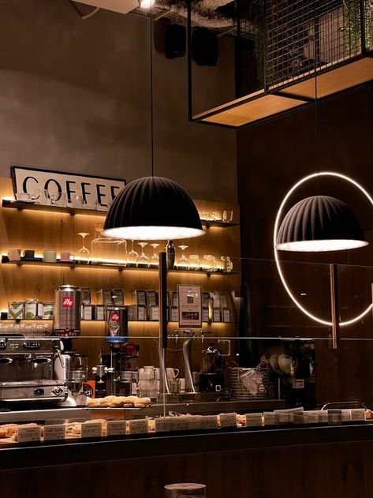
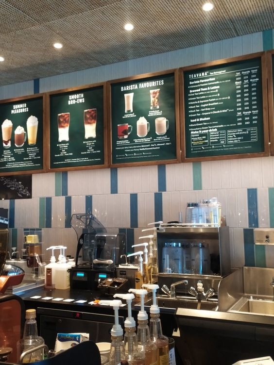
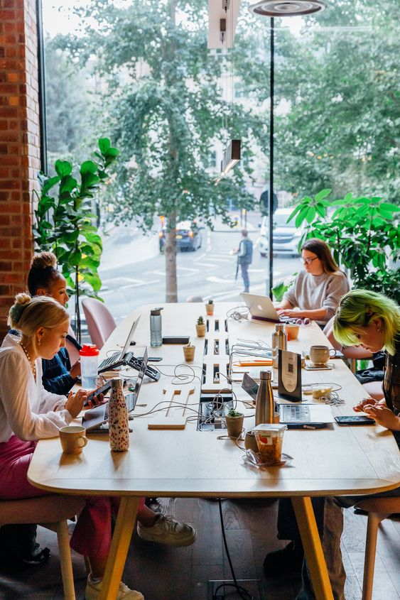
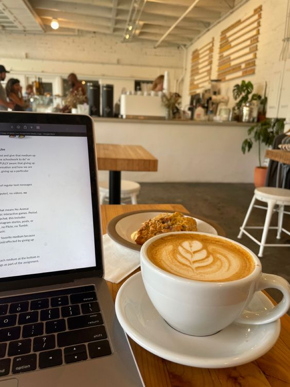

# cozy-cup

## Project Description

Welcome to  cozy-cup, a project that brings you experience cafe to digital world.

## Features

- **Virtual Cafe Atmosphere:** Immerse yourself in the ambiance of a cozy cafe, complete with soothing background sounds and visuals.
  
- **Customizable Settings:** Tailor your experience by adjusting background music, ambient noise, and lighting to create your ideal cafe environment.

- **Collaborative Spaces:** Share the virtual cafe with friends or colleagues for a productive and enjoyable collaborative experience.

- **Realistic Interactions:** Engage in realistic interactions, like ordering virtual drinks and snacks, to enhance the cafe experience.

  ### Image 1: Virtual Cafe Ambiance

Experience the inviting atmosphere of the **Cozy Cup Cafe** with warm lighting, comfortable seating, and subtle background chatter.

### Image 2: Customization Options

Tailor your cafe experience by adjusting settings such as background music, ambient noise, and lighting to match your preferences.

### Image 3: Collaborative Spaces

Invite friends or colleagues to join you in the virtual cafe for a shared, collaborative environment.

### Image 4: Realistic Interactions

Engage in immersive interactions like ordering virtual drinks and snacks, adding a touch of realism to your digital cafe experience.

## About the Author
- **Name:** Jan Ivn  Anthony Conde
- **Email:** aybanyan@gmail.com

<!DOCTYPE html>
<html lang="en">
<head>
    <meta charset="UTF-8">
    <meta name="viewport" content="width=device-width, initial-scale=1.0">
</head>
<body>

</body>
</html>

